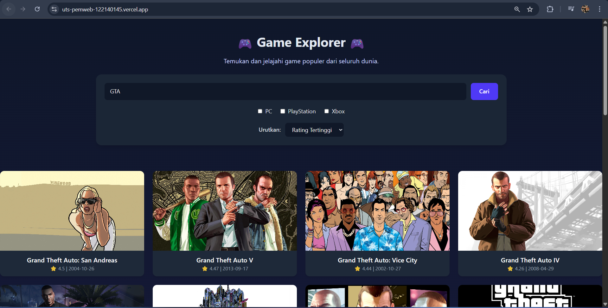
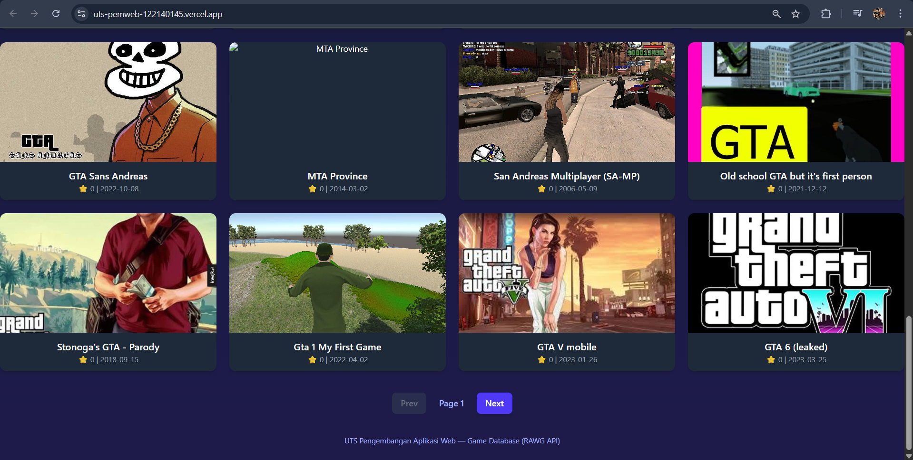

#  UTS Pengembangan Aplikasi Web  
**Nama:** Dyo Dwi Carol Bukit  
**NIM:** 122140145  

---

##  Deskripsi Proyek

Proyek ini merupakan bagian dari **UTS mata kuliah Pengembangan Aplikasi Web**.  
Aplikasi ini bernama **Game Explorer**, yaitu website pencarian game yang menampilkan informasi detail tentang berbagai game dari seluruh dunia dengan data yang diambil dari **[RAWG Video Games Database API](https://rawg.io/apidocs)**.  

###  Fitur Utama
-  Pencarian game berdasarkan nama.  
-  Filter platform (PC, PlayStation, Xbox).  
-  Urutkan hasil berdasarkan *rating* tertinggi atau *rilis terbaru*.  
-  Tampilan grid interaktif untuk hasil pencarian game.  
-  Detail game dengan gambar dan deskripsi.  
-  Desain modern dengan Tailwind CSS dan nuansa gelap (*dark theme*).  

---

##  Cara Instalasi dan Menjalankan

Ikuti langkah-langkah berikut untuk menjalankan proyek di komputer lokal kamu:
```bash
1️. Clone repository
git clone https://github.com/DyoBukit/uts-pemweb-122140145.git

2 Masuk ke folder proyek
cd uts-pemweb-122140145/my-app

3 Intall dependensi
npm install

4 Buat file .env dan masukkan API key RAWG kamu
VITE_RAWG_API_KEY=978387347c674daf9e65418d4146cd06

5 Jalankan server pengembangan
npm run dev dan kemudian buka browser yang disediakan
``` 

---

## Link Deployment
https://uts-pemweb-122140145.vercel.app

---

## Teknologi yang Digunakan
1. ReactReact JS (Vite)	-> Framework utama
2. Tailwind CSS	-> Styling modern dan responsif
3. Axios -> Mengambil data dari API
4. RAWG API ->	Sumber data game
5. Vercel -> Deployment aplikasi

---

## Screenshot Aplikasi 
Berikut tampilan hasil aplikasi yang sudah saya buat: 



---

## Pembuat 
- Nama: Dyo Dwi Carol Bukit
- NIM: 122140145
- Mata Kuliah: Pengembangan Aplikasi Web
- Dosen Pengampu: M. Habib Al Gifari, S.Kom., M.T.I
